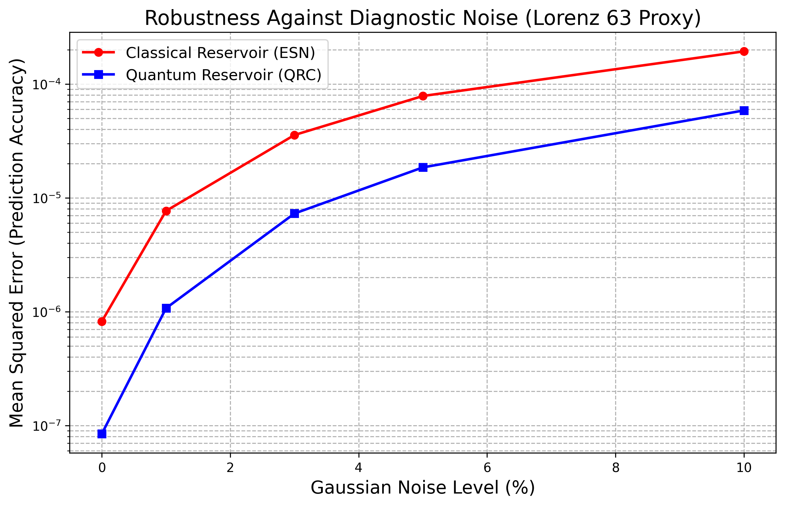
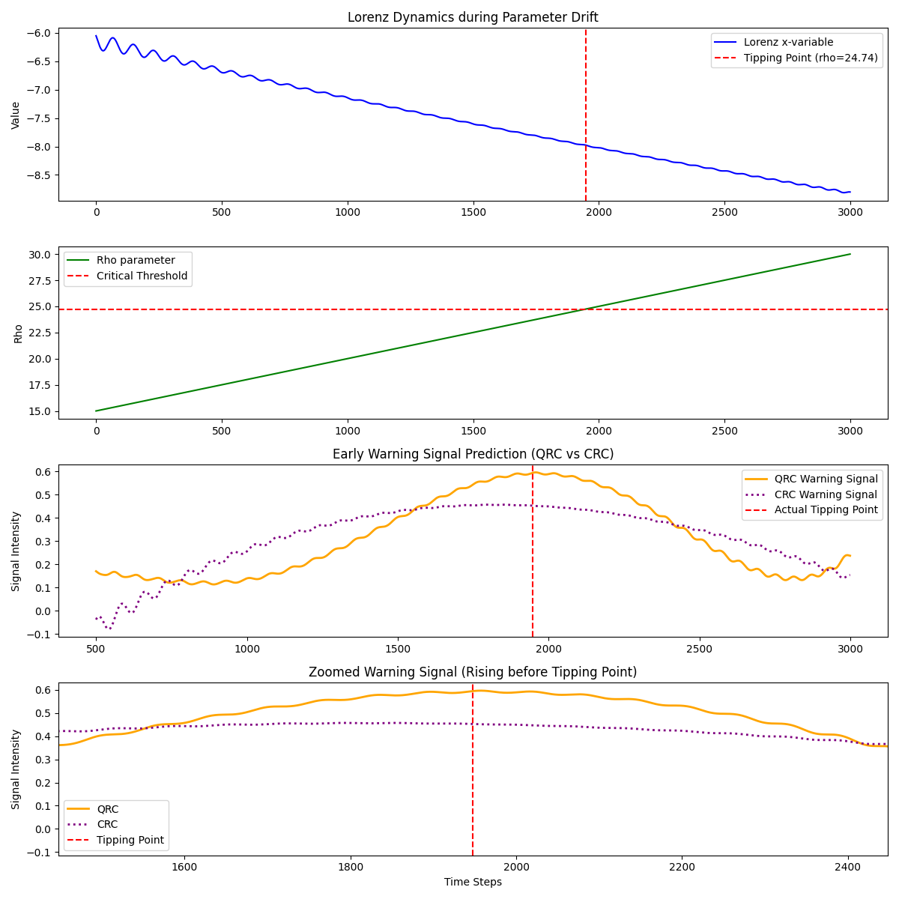
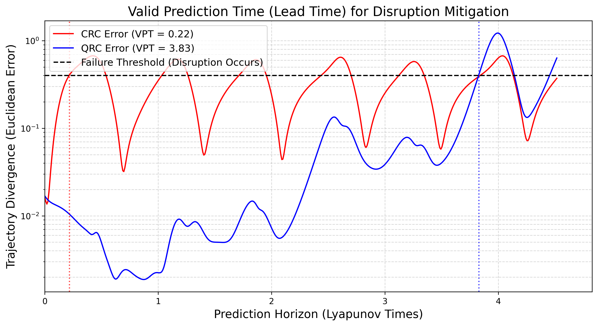

# ⚛️ Quantum Reservoir Computing for Plasma Disruption Prediction

> **Applicability Proof-of-Concept (Evaluation 1)**
>
> Applying Quantum Reservoir Computing (QRC) to disruption prediction and adaptive control in nuclear fusion. Built on top of the peer-reviewed work:
> [*Robust quantum reservoir computers for forecasting chaotic dynamics: generalized synchronization and stability*](https://doi.org/10.1098/rspa.2025.0550)

---

## 📋 Table of Contents

- [Overview](#overview)
- [Results at a Glance](#results-at-a-glance)
- [Project Structure](#project-structure)
- [Installation](#installation)
- [Running the Experiments](#running-the-experiments)
  - [1. Noise Robustness](#1-noise-robustness-experiment)
  - [2. Quantum Advantage / Transition Detection](#2-quantum-advantage--transition-experiment)
  - [3. Valid Prediction Time (VPT)](#3-valid-prediction-time-vpt-experiment)
- [Reference](#reference)

---

## Overview

This project investigates whether **Quantum Reservoir Computing (QRC)** offers a practical advantage over classical reservoir computing for predicting plasma instabilities in nuclear fusion devices. Three targeted experiments probe different axes of performance:

| Experiment | Question Being Asked |
|---|---|
| Noise Robustness | Does QRC degrade more gracefully than CRC under increasing measurement noise? |
| Quantum Advantage / Transitions | Can QRC detect tipping points and chaotic transitions earlier than CRC? |
| Valid Prediction Time (VPT) | How far ahead can QRC predict system disruptions in the Lorenz '63 system? |

---

## Results at a Glance

### Noise Robustness



*Performance comparison of QRC and CRC across varying levels of injected Gaussian noise.*

---

### Quantum Advantage: Transition / Tipping Point Detection



*Early warning signal comparison between QRC and CRC for detecting chaotic tipping points.*

---

### Valid Prediction Time (VPT)



*Lead-time (VPT) comparison for predicting system disruptions in the Lorenz '63 attractor.*

---

## Project Structure

```
.
├── Stability_QRC_GS-main/          # Core QRC framework source code
├── Noise_Robustness_Experiment/    # QRC vs CRC under Gaussian noise
│   ├── noise_robustness.py
│   └── Noise_Robustness_QRC_vs_CRC.png
├── Quantum_Adv/                    # Tipping point / transition detection
│   ├── transition_experiment.py
│   └── transition_results_comparison.png
├── VPT_Experiment/                 # Valid Prediction Time evaluation
│   ├── vpt_experiment.py
│   └── VPT_Comparison_QRC_CRC.png
├── requirements.txt
└── README.md
```

---

## Installation

**Recommended Python version:** 3.10.x

It is strongly recommended to use a virtual environment.

```bash
python -m venv venv
source venv/bin/activate       # On Windows: venv\Scripts\activate
pip install -r requirements.txt
```

---

## Running the Experiments

All experiments must be run from the **root directory** of the project so that the `sys.path` additions in each script resolve correctly.

---

### 1. Noise Robustness Experiment

Compares QRC and Classical Reservoir Computing (CRC) across varying levels of injected Gaussian noise to evaluate robustness.

```bash
python Noise_Robustness_Experiment/noise_robustness.py
```

**Output:** `Noise_Robustness_Experiment/Noise_Robustness_QRC_vs_CRC.png`

---

### 2. Quantum Advantage / Transition Experiment

Analyzes the detection of tipping points and chaotic transitions, comparing early warning signal quality between QRC and CRC.

```bash
python Quantum_Adv/transition_experiment.py
```

**Output:** `Quantum_Adv/transition_results_comparison.png`

---

### 3. Valid Prediction Time (VPT) Experiment

Evaluates the lead time (VPT) achievable when predicting system disruptions in the Lorenz '63 attractor.

```bash
python VPT_Experiment/vpt_experiment.py
```

**Output:** `VPT_Experiment/VPT_Comparison_QRC_CRC.png`

---

## Reference

```bibtex
@article{ahmed2025robust,
  title   = {Robust quantum reservoir computers for forecasting chaotic dynamics:
             generalized synchronization and stability},
  journal = {Proceedings of the Royal Society A},
  year    = {2025},
  doi     = {10.1098/rspa.2025.0550}
}
```
